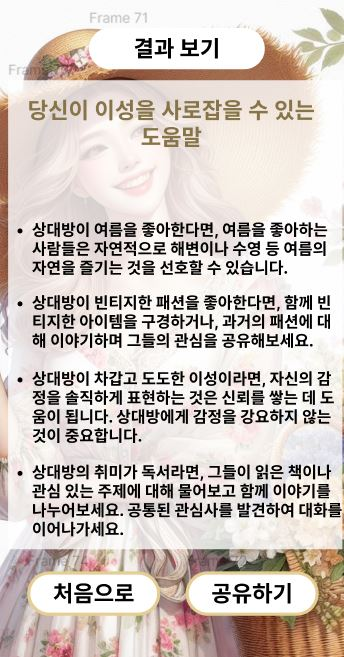

# Sometimez

**사랑을 쉽게 시작 히기 위해 코멘트를 알려주는 서비스이자, 원하는 카테고리를 누르며 원하는 이상형에 도달하는 과정을 사진으로 보여주며  최종 단계에선 결과를 보여주는 서비스입니다.**

## 목표
이 서비스는 연애를 성공하게 해주는 서비스가 아니라, 사용자에게 조언을 권하여 연애 성공을 권장하는 서비스입니다. 결국 연애 성공의 여부는 본인에게 달려있음을 다시 한번 강조하여 가장 근본적인 것은 본인의 마음가짐 이라는 것을 알려주는 서비스입니다.  

**연애 100% 성공하는 방법 제공 하지 않으며,  단순하게 조언”만” 주지 않습니다.**

## 기술 스택
- 💻 **프론트엔드:** React.js
- 🛠️ **백엔드**: Spring-Boot
- 🗃️ **데이터베이스:** MySQL

[//]: # (## 접속 도메인)
[//]: # (### [Sometimez]&#40;&#41;)

## 사용법
1. 웹 앱에 사용자가 들어온다.
2. 이상형의 정보를 입력하고 설문조사를 한다.
3. 설문조사를 바탕으로 조언을 얻는다.
4. 조언을 공유하여 남에게도 서비스를 권유한다.

## 주요 기능
- [선택에 따른 배경 사진 제공]
- [선택에 따른 조언 제공  및 이상형 사진 제공]
- [공유하기 기능]

## 실행 사진
<figure class="half">

</figure>
<figure class="half">

</figure>

## 사용 방법
1. 프로젝트를 클론한다.
2. 폴더 안에서 npm i 를 입력하여 패키지 매니저를 다운받는다.
3. npm start를 실행한다.
4. 웹 앱 버전으로 구현되어있기에 개발자 도구를 이용하여 모바일 웹 버전을 이용한다.

## 연락처 정보
**질문이나 문의사항이 있으시면 jodandan(깃허브닉네임)을 찾아주세요.**
